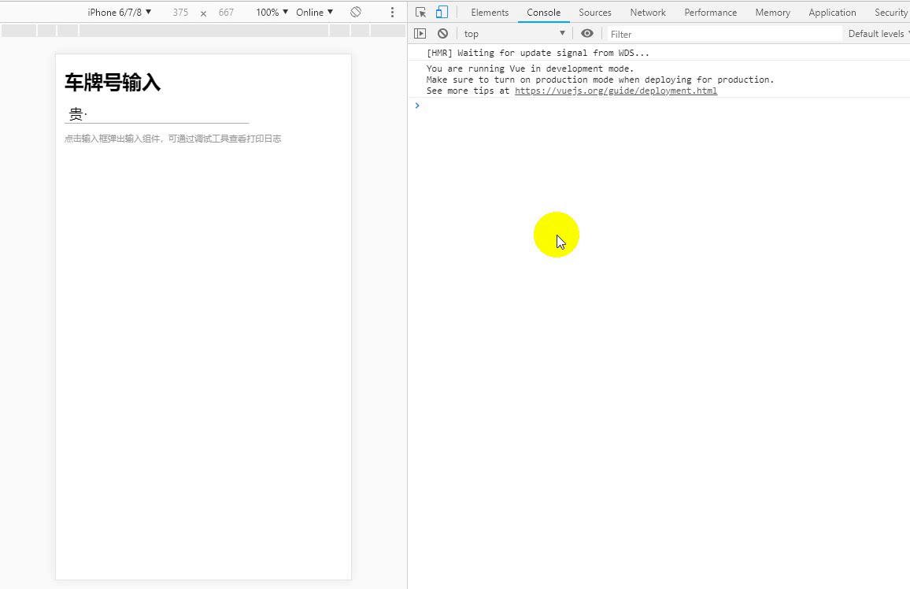

# vue-car-plate
基于H5项目的一个车牌号码输入组件，支持新能源车牌号输入

A vehicle license plate number keyboard



# requirement

vue2.x

# Install

### NPM

```shell
$ npm install vue-vehicle-plate -D
```

### yarn

```shell
$ yarn add vue-vehicle-plate --save
```

# Usage

```javascript
import VueVehiclePlate from "./vue-vehicle-plate";

Vue.use(VueVehiclePlate);
```
### props

| Props Name   | Type's | Default   | Description   |
| :----------- | ------ | --------- | ------------- |
| initValue | String | "" | 绑定的表单值，例如：‘川A’，<font color=#4285f4>只检验前两位正确性</font>并过滤‘·’ |
| limitProvince | String | "" | 限制省份列表，不用间隔，不限制则为全部省份可选 |
| limitCity | String | "" |  限制城市列表， 不用间隔，不限制则为全部城市可选 |

